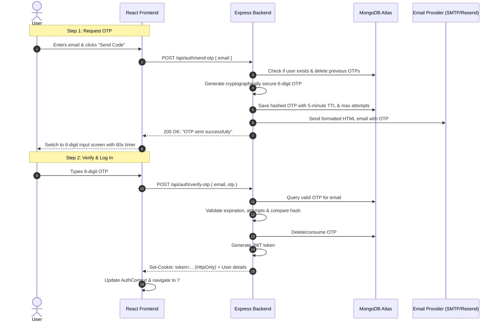

# Email OTP-Based Login Implementation Guide

This guide provides a comprehensive, production-ready implementation of **Email OTP (One-Time Password) Authentication** for both the **Backend (Node.js/Express/MongoDB)** and **Frontend (React/Vite)** in SkillBridge AI.

---

## Table of Contents

1. [Architecture & Workflow](#1-architecture--workflow)
2. [Backend Implementation](#2-backend-implementation)
   - [A. Install Dependencies](#a-install-dependencies)
   - [B. Environment Variables](#b-environment-variables)
   - [C. OTP Database Model (with Auto-Expiry TTL)](#c-otp-database-model-with-auto-expiry-ttl)
   - [D. Email Transporter Service (Nodemailer / Resend)](#d-email-transporter-service-nodemailer--resend)
   - [E. Auth Controller Updates (Send OTP & Verify OTP)](#e-auth-controller-updates-send-otp--verify-otp)
   - [F. Auth Routes & Rate Limiting](#f-auth-routes--rate-limiting)
3. [Frontend Implementation](#3-frontend-implementation)
   - [A. Auth API Service Updates](#a-auth-api-service-updates)
   - [B. Auth Context & Custom Hook](#b-auth-context--custom-hook)
   - [C. OTP Login Component (2-Step UI with Countdown & Auto-Focus)](#c-otp-login-component-2-step-ui-with-countdown--auto-focus)
4. [Security & Production Best Practices](#4-security--production-best-practices)
5. [Testing the Flow](#5-testing-the-flow)

---

## 1. Architecture & Workflow



---

## 2. Backend Implementation

### A. Install Dependencies

In `backend/`, install `nodemailer` and `crypto` (built into Node.js):

```bash
cd backend
npm install nodemailer
```

---

### B. Environment Variables

Add the following to `backend/.env` and `backend/.env.example`:

```env
# Email SMTP Configuration (e.g. Gmail App Password, Brevo, SendGrid, or Resend)
EMAIL_HOST=smtp.gmail.com
EMAIL_PORT=587
EMAIL_USER=your-email@gmail.com
EMAIL_PASS=your-app-specific-password
EMAIL_FROM="SkillBridge AI <no-reply@skillbridge.ai>"
```

> [!TIP]
> If using Gmail, enable 2-Step Verification in your Google Account and generate an **App Password** under Security settings.

---

### C. OTP Database Model (with Auto-Expiry TTL)

Create `backend/src/models/otp.model.js`:

```javascript
const mongoose = require("mongoose");

const otpSchema = new mongoose.Schema({
  email: {
    type: String,
    required: true,
    lowercase: true,
    trim: true,
    index: true,
  },
  otp: {
    type: String, // Stored as bcrypt hash for security
    required: true,
  },
  attempts: {
    type: Number,
    default: 0, // Max 3-5 failed attempts before invalidation
  },
  createdAt: {
    type: Date,
    default: Date.now,
    expires: 300, // MongoDB TTL Index: Document automatically deletes after 300 seconds (5 mins)
  },
});

const OtpModel = mongoose.model("otps", otpSchema);

module.exports = OtpModel;
```

---

### D. Email Transporter Service

Create `backend/src/services/email.service.js`:

```javascript
const nodemailer = require("nodemailer");

const transporter = nodemailer.createTransport({
  host: process.env.EMAIL_HOST || "smtp.gmail.com",
  port: parseInt(process.env.EMAIL_PORT || "587", 10),
  secure: process.env.EMAIL_PORT === "465", // true for 465, false for other ports
  auth: {
    user: process.env.EMAIL_USER,
    pass: process.env.EMAIL_PASS,
  },
});

/**
 * Sends a modern, branded OTP email to the user.
 * @param {string} to - Recipient email
 * @param {string} otp - 6-digit OTP code
 */
async function sendOtpEmail(to, otp) {
  const mailOptions = {
    from:
      process.env.EMAIL_FROM || '"SkillBridge AI" <no-reply@skillbridge.ai>',
    to,
    subject: "Your SkillBridge AI Login Code",
    html: `
        <div style="font-family: -apple-system, BlinkMacSystemFont, 'Segoe UI', Roboto, Helvetica, Arial, sans-serif; max-width: 520px; margin: 0 auto; padding: 32px 24px; background: #0f172a; color: #f8fafc; border-radius: 12px; border: 1px solid #1e293b;">
            <div style="margin-bottom: 24px;">
                <span style="font-size: 14px; font-weight: 700; letter-spacing: 1px; color: #38bdf8; text-transform: uppercase;">SKILLBRIDGE AI</span>
            </div>
            <h1 style="font-size: 22px; font-weight: 600; color: #ffffff; margin-bottom: 12px;">Verification Code</h1>
            <p style="font-size: 15px; color: #94a3b8; line-height: 1.5; margin-bottom: 24px;">
                Use the following 6-digit code to sign in to your SkillBridge AI account. This code is valid for <strong>5 minutes</strong>.
            </p>
            <div style="background: #1e293b; border: 1px solid #334155; border-radius: 8px; padding: 18px 24px; text-align: center; margin-bottom: 24px;">
                <span style="font-size: 32px; font-weight: 700; letter-spacing: 8px; color: #38bdf8; font-family: monospace;">${otp}</span>
            </div>
            <p style="font-size: 13px; color: #64748b; line-height: 1.5; margin: 0;">
                If you did not request this code, you can safely ignore this email. Never share this code with anyone.
            </p>
        </div>
        `,
  };

  return transporter.sendMail(mailOptions);
}

module.exports = { sendOtpEmail };
```

---

### E. Auth Controller Updates (Send OTP & Verify OTP)

In `backend/src/controllers/auth.controller.js`, add `sendOtpController` and `verifyOtpController`:

```javascript
const crypto = require("crypto");
const bcrypt = require("bcrypt");
const jwt = require("jsonwebtoken");
const userModel = require("../models/user.model");
const OtpModel = require("../models/otp.model");
const { sendOtpEmail } = require("../services/email.service");

const isProduction = process.env.NODE_ENV === "production";

const cookieOptions = {
  httpOnly: true,
  secure: isProduction,
  sameSite: isProduction ? "none" : "lax",
  maxAge: 7 * 24 * 60 * 60 * 1000, // 7 days
};

/**
 * @name sendOtpController
 * @route POST /api/auth/send-otp
 * @desc Generate and send OTP to user's email
 */
async function sendOtpController(req, res) {
  try {
    const { email } = req.body;

    if (!email) {
      return res.status(400).json({ message: "Email is required" });
    }

    const normalizedEmail = email.toLowerCase().trim();

    // Check if user exists (or auto-create if building passwordless signup)
    const user = await userModel.findOne({ email: normalizedEmail });
    if (!user) {
      return res
        .status(404)
        .json({ message: "No account found with this email address" });
    }

    // Generate cryptographically secure 6-digit numeric OTP
    const rawOtp = crypto.randomInt(100000, 999999).toString();

    // Hash the OTP before storing for maximum security
    const hashedOtp = await bcrypt.hash(rawOtp, 10);

    // Remove any previous active OTPs for this email
    await OtpModel.deleteMany({ email: normalizedEmail });

    // Save new OTP record
    await OtpModel.create({
      email: normalizedEmail,
      otp: hashedOtp,
      attempts: 0,
    });

    // Send email
    await sendOtpEmail(normalizedEmail, rawOtp);

    return res.status(200).json({
      message: "Verification code sent to your email",
    });
  } catch (error) {
    console.error("sendOtpController error:", error);
    return res
      .status(500)
      .json({ message: "Failed to send verification code. Please try again." });
  }
}

/**
 * @name verifyOtpController
 * @route POST /api/auth/verify-otp
 * @desc Verify OTP and authenticate user
 */
async function verifyOtpController(req, res) {
  try {
    const { email, otp } = req.body;

    if (!email || !otp) {
      return res
        .status(400)
        .json({ message: "Email and OTP code are required" });
    }

    const normalizedEmail = email.toLowerCase().trim();

    // Find active OTP record
    const otpRecord = await OtpModel.findOne({ email: normalizedEmail });
    if (!otpRecord) {
      return res.status(400).json({
        message:
          "Verification code expired or invalid. Please request a new one.",
      });
    }

    // Brute force protection: max 5 failed attempts
    if (otpRecord.attempts >= 5) {
      await OtpModel.deleteOne({ _id: otpRecord._id });
      return res.status(429).json({
        message: "Too many failed attempts. Please request a new code.",
      });
    }

    // Compare OTP
    const isMatch = await bcrypt.compare(otp.trim(), otpRecord.otp);
    if (!isMatch) {
      otpRecord.attempts += 1;
      await otpRecord.save();
      return res
        .status(400)
        .json({ message: "Incorrect verification code. Please try again." });
    }

    // OTP is valid -> delete it so it cannot be reused
    await OtpModel.deleteOne({ _id: otpRecord._id });

    // Find user
    const user = await userModel.findOne({ email: normalizedEmail });
    if (!user) {
      return res.status(404).json({ message: "User not found" });
    }

    // Generate JWT token
    const token = jwt.sign(
      { id: user._id, username: user.username },
      process.env.JWT_SECRET,
      { expiresIn: "7d" },
    );

    res.cookie("token", token, cookieOptions);

    return res.status(200).json({
      message: "Login successful",
      user: {
        id: user._id,
        username: user.username,
        email: user.email,
      },
    });
  } catch (error) {
    console.error("verifyOtpController error:", error);
    return res
      .status(500)
      .json({ message: "Verification failed. Please try again." });
  }
}
```

---

### F. Auth Routes & Rate Limiting

In `backend/src/routes/auth.routes.js`:

```javascript
// Stricter rate limiter for sending OTP (e.g., max 5 requests per 10 mins per IP)
const otpLimiter = rateLimit({
  windowMs: 10 * 60 * 1000,
  max: 5,
  message: {
    message:
      "Too many verification requests. Please wait a few minutes before trying again.",
  },
});

authRouter.post("/send-otp", otpLimiter, authController.sendOtpController);
authRouter.post("/verify-otp", authController.verifyOtpController);
```

---

## 3. Frontend Implementation

### A. Auth API Service Updates

In `frontend/src/features/auth/services/auth.api.js`, add:

```javascript
export async function sendOtp({ email }) {
  const response = await api.post("/api/auth/send-otp", { email });
  return response.data;
}

export async function verifyOtp({ email, otp }) {
  const response = await api.post("/api/auth/verify-otp", { email, otp });
  return response.data;
}
```

---

### B. Auth Context & Custom Hook

In `frontend/src/features/auth/hooks/useAuth.js` (or `auth.context.jsx`), expose the OTP handler:

```javascript
const handleOtpLogin = async ({ email, otp }) => {
  setLoading(true);
  try {
    const data = await verifyOtp({ email, otp });
    setUser(data.user);
    return data;
  } finally {
    setLoading(false);
  }
};
```

---

### C. OTP Login Component

Create/update `frontend/src/features/auth/pages/Login.jsx`:

```jsx
import React, { useState, useEffect, useRef } from "react";
import { useNavigate, Link } from "react-router";
import { useAuth } from "../hooks/useAuth";
import { sendOtp, verifyOtp } from "../services/auth.api";
import "../auth.form.scss";

const Login = () => {
  const { setUser } = useAuth();
  const navigate = useNavigate();

  // Steps: 'email' (Step 1) | 'otp' (Step 2)
  const [step, setStep] = useState("email");
  const [email, setEmail] = useState("");
  const [otp, setOtp] = useState(["", "", "", "", "", ""]);
  const [loading, setLoading] = useState(false);
  const [error, setError] = useState("");
  const [timer, setTimer] = useState(60);
  const [canResend, setCanResend] = useState(false);

  const inputRefs = useRef([]);

  // ── Resend Countdown Timer ───────────────────────────────────────────
  useEffect(() => {
    let interval = null;
    if (step === "otp" && timer > 0) {
      interval = setInterval(() => setTimer((t) => t - 1), 1000);
    } else if (timer === 0) {
      setCanResend(true);
    }
    return () => clearInterval(interval);
  }, [step, timer]);

  // ── Step 1: Send OTP ────────────────────────────────────────────────
  const handleSendOtp = async (e) => {
    e?.preventDefault();
    setError("");
    setLoading(true);
    try {
      await sendOtp({ email });
      setStep("otp");
      setTimer(60);
      setCanResend(false);
    } catch (err) {
      setError(
        err.response?.data?.message || "Failed to send verification code.",
      );
    } finally {
      setLoading(false);
    }
  };

  // ── Handle 6-Digit OTP Inputs ────────────────────────────────────────
  const handleOtpChange = (index, value) => {
    if (!/^\d*$/.test(value)) return; // Only numbers
    const newOtp = [...otp];
    newOtp[index] = value.slice(-1); // Take last digit
    setOtp(newOtp);

    // Auto-focus next input
    if (value && index < 5) {
      inputRefs.current[index + 1]?.focus();
    }
  };

  const handleKeyDown = (index, e) => {
    if (e.key === "Backspace" && !otp[index] && index > 0) {
      inputRefs.current[index - 1]?.focus();
    }
  };

  const handlePaste = (e) => {
    const pasteData = e.clipboardData.getData("text").trim();
    if (/^\d{6}$/.test(pasteData)) {
      setOtp(pasteData.split(""));
      inputRefs.current[5]?.focus();
    }
  };

  // ── Step 2: Verify OTP ──────────────────────────────────────────────
  const handleVerifyOtp = async (e) => {
    e?.preventDefault();
    const code = otp.join("");
    if (code.length !== 6) {
      setError("Please enter the complete 6-digit code.");
      return;
    }

    setError("");
    setLoading(true);
    try {
      const data = await verifyOtp({ email, otp: code });
      setUser(data.user);
      navigate("/");
    } catch (err) {
      setError(err.response?.data?.message || "Invalid or expired code.");
    } finally {
      setLoading(false);
    }
  };

  return (
    <main className="auth-page">
      <div className="auth-card">
        <div className="auth-card__brand">
          <span className="auth-card__brand-dot" />
          SKILLBRIDGE AI
        </div>

        <div className="auth-card__header">
          <h1 className="auth-card__title">
            {step === "email" ? "Sign In with Email" : "Check your inbox"}
          </h1>
          <p className="auth-card__subtitle">
            {step === "email"
              ? "Enter your email to receive a 6-digit verification code"
              : `We sent a code to ${email}`}
          </p>
        </div>

        {error && <div className="auth-error">{error}</div>}

        {step === "email" ? (
          <form onSubmit={handleSendOtp} className="auth-form">
            <div className="auth-field">
              <label className="auth-label">Email address</label>
              <input
                type="email"
                className="auth-input"
                placeholder="name@company.com"
                value={email}
                onChange={(e) => setEmail(e.target.value)}
                required
                autoFocus
              />
            </div>
            <button type="submit" className="auth-button" disabled={loading}>
              {loading ? "Sending code..." : "Continue with Email"}
            </button>
          </form>
        ) : (
          <form onSubmit={handleVerifyOtp} className="auth-form">
            <div
              className="otp-inputs-container"
              style={{
                display: "flex",
                gap: "8px",
                justifyContent: "center",
                margin: "16px 0",
              }}
            >
              {otp.map((digit, idx) => (
                <input
                  key={idx}
                  ref={(el) => (inputRefs.current[idx] = el)}
                  type="text"
                  inputMode="numeric"
                  maxLength={1}
                  value={digit}
                  onChange={(e) => handleOtpChange(idx, e.target.value)}
                  onKeyDown={(e) => handleKeyDown(idx, e)}
                  onPaste={handlePaste}
                  style={{
                    width: "44px",
                    height: "52px",
                    fontSize: "22px",
                    fontWeight: "600",
                    textAlign: "center",
                    background: "#0f172a",
                    border: "1px solid #334155",
                    borderRadius: "8px",
                    color: "#ffffff",
                  }}
                  autoFocus={idx === 0}
                />
              ))}
            </div>

            <button
              type="submit"
              className="auth-button"
              disabled={loading || otp.join("").length !== 6}
            >
              {loading ? "Verifying..." : "Verify & Sign In"}
            </button>

            <div
              style={{
                marginTop: "16px",
                textAlign: "center",
                fontSize: "14px",
                color: "#94a3b8",
              }}
            >
              {canResend ? (
                <button
                  type="button"
                  onClick={handleSendOtp}
                  style={{
                    background: "none",
                    border: "none",
                    color: "#38bdf8",
                    cursor: "pointer",
                    fontWeight: "500",
                  }}
                >
                  Resend code
                </button>
              ) : (
                <span>Resend code in {timer}s</span>
              )}
              <span style={{ margin: "0 8px" }}>•</span>
              <button
                type="button"
                onClick={() => {
                  setStep("email");
                  setOtp(["", "", "", "", "", ""]);
                  setError("");
                }}
                style={{
                  background: "none",
                  border: "none",
                  color: "#64748b",
                  cursor: "pointer",
                }}
              >
                Change email
              </button>
            </div>
          </form>
        )}

        <div className="auth-card__footer">
          <p>
            Don't have an account? <Link to="/register">Create one</Link>
          </p>
        </div>
      </div>
    </main>
  );
};

export default Login;
```

---

## 4. Security & Production Best Practices

1. **OTP Hashing**: Never store plain-text OTPs in the database. Storing them as bcrypt hashes prevents compromise in the event of database read leaks.
2. **MongoDB TTL Indexes**: Use MongoDB's `expires: 300` index to automatically purge old OTPs from memory/disk without background cron jobs.
3. **Brute Force & Rate Limiting**: Limit failed verification attempts per OTP (e.g. max 5 attempts) and rate limit `/api/auth/send-otp` to 5 requests per 10 minutes per IP.
4. **Single-Use Tokens**: Delete the OTP immediately upon successful verification.
5. **Secure Cookie Settings**: Maintain `httpOnly: true`, `secure: true` (in prod), and `sameSite: 'none'` (cross-domain) on the JWT session cookie.

---

## 5. Testing the Flow

1. Set valid SMTP credentials in `.env`.
2. Start the backend (`npm run dev`) and frontend (`npm run dev`).
3. Open `http://localhost:5173/login`.
4. Enter your registered email address and submit.
5. Check your email inbox for the 6-digit code.
6. Paste or type the 6 digits; verification will complete and log you into the dashboard.
