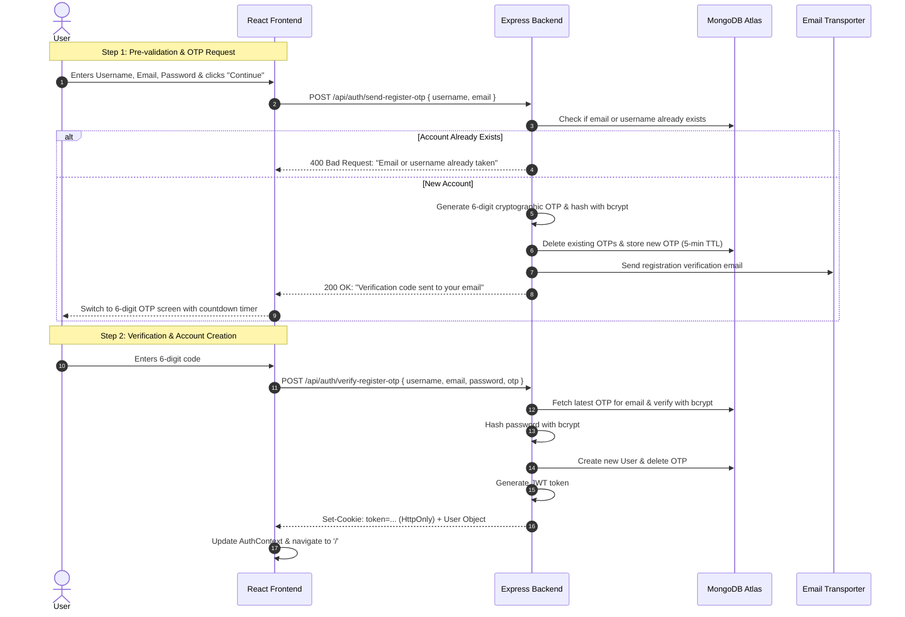

# Email OTP Registration Implementation Guide

This guide walks through implementing **Email OTP Verification for User Registration** across both the **Backend** (Node.js/Express/MongoDB) and **Frontend** (React/Vite).

---

## Table of Contents

1. [Architecture & Workflow](#1-architecture--workflow)
2. [Backend Implementation](#2-backend-implementation)
   - [A. Controller Updates (Send Register OTP & Verify and Register)](#a-controller-updates-send-register-otp--verify-and-register)
   - [B. Route Setup & Rate Limiting](#b-route-setup--rate-limiting)
3. [Frontend Implementation](#3-frontend-implementation)
   - [A. Auth API Service](#a-auth-api-service)
   - [B. Auth Hook (`useAuth.js`)](#b-auth-hook-useauthjs)
   - [C. 2-Step Register Component (`Register.jsx`)](#c-2-step-register-component-registerjsx)
4. [Security & Production Best Practices](#4-security--production-best-practices)
5. [Testing Checklist](#5-testing-checklist)

---

## 1. Architecture & Workflow



---

## 2. Backend Implementation

### A. Controller Updates (`backend/src/controllers/auth.controller.js`)

Add `sendRegisterOtpController` and `verifyRegisterOtpController`:

```javascript
/**
 * @name sendRegisterOtpController
 * @route POST /api/auth/send-register-otp
 * @desc Pre-checks unique username & email, then generates and sends an OTP for registration
 * @access Public
 */
async function sendRegisterOtpController(req, res) {
    try {
        const { username, email } = req.body;

        if (!username || !email) {
            return res.status(400).json({ message: "Username and email are required" });
        }

        const normalizedEmail = email.toLowerCase().trim();
        const normalizedUsername = username.trim();

        // 1. Guard: Check if email or username is already taken
        const existingUser = await userModel.findOne({
            $or: [
                { email: normalizedEmail },
                { username: normalizedUsername }
            ]
        });

        if (existingUser) {
            if (existingUser.email === normalizedEmail) {
                return res.status(400).json({ message: "An account already exists with this email address" });
            }
            return res.status(400).json({ message: "Username is already taken. Please choose another." });
        }

        // 2. Generate 6-digit OTP
        const rawOtp = crypto.randomInt(100000, 1000000).toString();

        if (process.env.NODE_ENV !== 'production') {
            console.log(`[REGISTER OTP DEV] Generated OTP for ${normalizedEmail}: ${rawOtp}`);
        }

        // 3. Hash OTP before saving
        const hashedOtp = await bcrypt.hash(rawOtp, 10);

        // 4. Remove previous OTPs for this email & save new record
        await OtpModel.deleteMany({ email: normalizedEmail });
        await OtpModel.create({
            email: normalizedEmail,
            otp: hashedOtp,
            attempts: 0
        });

        // 5. Send Email
        await sendOtpEmail(normalizedEmail, rawOtp);

        return res.status(200).json({
            message: "Verification code sent to your email"
        });
    } catch (error) {
        console.error("sendRegisterOtpController error:", error);
        return res.status(500).json({ message: "Failed to send verification code. Please try again." });
    }
}

/**
 * @name verifyRegisterOtpController
 * @route POST /api/auth/verify-register-otp
 * @desc Verifies OTP, hashes password, creates the User document, and signs JWT session
 * @access Public
 */
async function verifyRegisterOtpController(req, res) {
    try {
        const { username, email, password, otp } = req.body;

        if (!username || !email || !password || !otp) {
            return res.status(400).json({ message: "All fields are required" });
        }

        const normalizedEmail = email.toLowerCase().trim();
        const normalizedUsername = username.trim();
        const cleanOtp = String(otp).trim();

        // 1. Double check user doesn't already exist
        const isUserAlreadyExists = await userModel.findOne({
            $or: [{ username: normalizedUsername }, { email: normalizedEmail }]
        });

        if (isUserAlreadyExists) {
            return res.status(400).json({ message: "User already exists with this email or username" });
        }

        // 2. Find latest active OTP record
        const otpRecord = await OtpModel.findOne({ email: normalizedEmail }).sort({ createdAt: -1 });
        if (!otpRecord) {
            return res.status(400).json({ message: "Verification code expired or invalid. Please request a new code." });
        }

        // 3. Brute force check: max 5 attempts
        if (otpRecord.attempts >= 5) {
            await OtpModel.deleteOne({ _id: otpRecord._id });
            return res.status(429).json({ message: "Too many failed attempts. Please request a new code." });
        }

        // 4. Compare OTP
        const isMatch = await bcrypt.compare(cleanOtp, otpRecord.otp);
        if (!isMatch) {
            otpRecord.attempts += 1;
            await otpRecord.save();
            return res.status(400).json({ message: "Incorrect verification code. Please try again." });
        }

        // 5. Delete consumed OTP
        await OtpModel.deleteMany({ email: normalizedEmail });

        // 6. Hash password & create user
        const hashedPassword = await bcrypt.hash(password, 10);
        const user = await userModel.create({
            username: normalizedUsername,
            email: normalizedEmail,
            password: hashedPassword
        });

        // 7. Sign JWT token & set HTTP-only cookie
        const token = jwt.sign(
            { id: user._id, username: user.username },
            process.env.JWT_SECRET,
            { expiresIn: "7d" }
        );

        res.cookie('token', token, cookieOptions);

        return res.status(201).json({
            message: "Account created successfully",
            user: {
                id: user._id,
                username: user.username,
                email: user.email
            }
        });
    } catch (error) {
        console.error("verifyRegisterOtpController error:", error);
        return res.status(500).json({ message: "Registration failed. Please try again." });
    }
}
```

Remember to export them at the bottom of `backend/src/controllers/auth.controller.js`:
```javascript
module.exports = {
    registerUserController,
    loginUserController,
    logoutUserController,
    getMeController,
    sendOtpController,
    verifyOtpController,
    sendRegisterOtpController,
    verifyRegisterOtpController
};
```

---

### B. Route Setup & Rate Limiting (`backend/src/routes/auth.routes.js`)

In `backend/src/routes/auth.routes.js`, mount the new endpoints with `otpLimiter`:

```javascript
/**
 * @route /api/auth/send-register-otp
 * @description Send OTP for new user registration
 * @access Public
 */
authRouter.post('/send-register-otp', otpLimiter, authController.sendRegisterOtpController);

/**
 * @route /api/auth/verify-register-otp
 * @description Verify OTP, create account & login
 * @access Public
 */
authRouter.post('/verify-register-otp', authController.verifyRegisterOtpController);
```

---

## 3. Frontend Implementation

### A. Auth API Service (`frontend/src/features/auth/services/auth.api.js`)

Add API request helpers:

```javascript
export async function sendRegisterOtp({ username, email }) {
    const response = await api.post("/api/auth/send-register-otp", { username, email });
    return response.data;
}

export async function verifyRegisterOtp({ username, email, password, otp }) {
    const response = await api.post("/api/auth/verify-register-otp", { username, email, password, otp });
    return response.data;
}
```

---

### B. Auth Hook (`frontend/src/features/auth/hooks/useAuth.js`)

Expose `handleRegisterWithOtp`:

```javascript
const handleRegisterWithOtp = async ({ username, email, password, otp }) => {
    try {
        setLoading(true);
        const data = await verifyRegisterOtp({ username, email, password, otp });
        setUser(data.user);
        return data;
    } catch (err) {
        throw err;
    } finally {
        setLoading(false);
    }
};
```

Add `handleRegisterWithOtp` to the return statement:
```javascript
return {
    user,
    setUser,
    loading,
    handleLogin,
    handleRegister,
    handleLogout,
    handleOtpLogin,
    handleRegisterWithOtp
};
```

---

### C. 2-Step Register Component (`frontend/src/features/auth/pages/Register.jsx`)

Replace `frontend/src/features/auth/pages/Register.jsx` with this 2-step component:

```jsx
import React, { useState, useEffect, useRef } from "react";
import { useNavigate, Link } from "react-router";
import { useAuth } from "../hooks/useAuth";
import { sendRegisterOtp, verifyRegisterOtp } from "../services/auth.api";
import "../auth.form.scss";

const Register = () => {
    const { setUser } = useAuth();
    const navigate = useNavigate();

    // Steps: 'form' (Step 1) | 'otp' (Step 2)
    const [step, setStep] = useState("form");
    const [username, setUsername] = useState("");
    const [email, setEmail] = useState("");
    const [password, setPassword] = useState("");
    const [otp, setOtp] = useState(["", "", "", "", "", ""]);
    const [loading, setLoading] = useState(false);
    const [error, setError] = useState("");
    const [timer, setTimer] = useState(60);
    const [canResend, setCanResend] = useState(false);

    const inputRefs = useRef([]);
    const isSubmittingRef = useRef(false);

    // ── Resend Countdown Timer ───────────────────────────────────────────
    useEffect(() => {
        let interval = null;
        if (step === "otp" && timer > 0) {
            interval = setInterval(() => setTimer((t) => t - 1), 1000);
        } else if (timer === 0) {
            setCanResend(true);
        }
        return () => clearInterval(interval);
    }, [step, timer]);

    // ── Step 1: Send Registration OTP ────────────────────────────────────
    const handleSendRegisterOtp = async (e) => {
        e?.preventDefault();
        setError("");
        setLoading(true);
        try {
            await sendRegisterOtp({ username, email });
            setStep("otp");
            setTimer(60);
            setCanResend(false);
        } catch (err) {
            setError(err.response?.data?.message || "Failed to send verification code.");
        } finally {
            setLoading(false);
        }
    };

    // ── Handle 6-Digit OTP Inputs ────────────────────────────────────────
    const handleOtpChange = (index, value) => {
        setError("");
        const cleaned = value.replace(/\D/g, "");
        if (!cleaned && value !== "") return;

        const newOtp = [...otp];
        newOtp[index] = cleaned ? cleaned.slice(-1) : "";
        setOtp(newOtp);

        if (cleaned && index < 5) {
            inputRefs.current[index + 1]?.focus();
        }
    };

    const handleKeyDown = (index, e) => {
        setError("");
        if (e.key === "Backspace" && !otp[index] && index > 0) {
            inputRefs.current[index - 1]?.focus();
        }
    };

    const handlePaste = (e) => {
        setError("");
        e.preventDefault();
        const pasteData = e.clipboardData.getData("text").replace(/\D/g, "").slice(0, 6);
        if (pasteData.length > 0) {
            const newOtp = ["", "", "", "", "", ""];
            pasteData.split("").forEach((ch, idx) => {
                if (idx < 6) newOtp[idx] = ch;
            });
            setOtp(newOtp);
            const nextIndex = Math.min(pasteData.length, 5);
            inputRefs.current[nextIndex]?.focus();
        }
    };

    // ── Step 2: Verify OTP & Create Account ──────────────────────────────
    const handleVerifyAndRegister = async (e) => {
        e?.preventDefault();
        if (isSubmittingRef.current) return;

        const code = otp.join("");
        if (code.length !== 6) {
            setError("Please enter the complete 6-digit code.");
            return;
        }

        isSubmittingRef.current = true;
        setError("");
        setLoading(true);

        try {
            const data = await verifyRegisterOtp({
                username,
                email,
                password,
                otp: code,
            });
            setUser(data.user);
            navigate("/");
        } catch (err) {
            console.error("Registration verification error:", err);
            const backendMessage = err.response?.data?.message;
            setError(backendMessage || err.message || "Invalid or expired code. Please try again.");
        } finally {
            setLoading(false);
            isSubmittingRef.current = false;
        }
    };

    return (
        <main className="auth-page">
            <div className="auth-card">
                <div className="auth-card__brand">
                    <span className="auth-card__brand-dot" />
                    SKILLBRIDGE AI
                </div>

                <div className="auth-card__header">
                    <h1 className="auth-card__title">
                        {step === "form" ? "Create Account" : "Verify Email"}
                    </h1>
                    <p className="auth-card__subtitle">
                        {step === "form"
                            ? "Start building your interview strategy"
                            : `We sent a verification code to ${email}`}
                    </p>
                </div>

                {error && <div className="auth-error">{error}</div>}

                {step === "form" ? (
                    <form onSubmit={handleSendRegisterOtp} className="auth-form">
                        <div className="auth-field">
                            <label className="auth-label">Username</label>
                            <input
                                type="text"
                                className="auth-input"
                                placeholder="johndoe"
                                value={username}
                                onChange={(e) => setUsername(e.target.value)}
                                required
                                autoFocus
                            />
                        </div>

                        <div className="auth-field">
                            <label className="auth-label">Email address</label>
                            <input
                                type="email"
                                className="auth-input"
                                placeholder="name@company.com"
                                value={email}
                                onChange={(e) => setEmail(e.target.value)}
                                required
                            />
                        </div>

                        <div className="auth-field">
                            <label className="auth-label">Password</label>
                            <input
                                type="password"
                                className="auth-input"
                                placeholder="••••••••"
                                value={password}
                                onChange={(e) => setPassword(e.target.value)}
                                required
                                minLength={6}
                            />
                        </div>

                        <button type="submit" className="auth-button" disabled={loading}>
                            {loading ? "Sending code..." : "Continue"}
                        </button>
                    </form>
                ) : (
                    <form onSubmit={handleVerifyAndRegister} className="auth-form">
                        <div
                            className="otp-inputs-container"
                            style={{
                                display: "flex",
                                gap: "8px",
                                justifyContent: "center",
                                margin: "16px 0",
                            }}
                        >
                            {otp.map((digit, idx) => (
                                <input
                                    key={idx}
                                    ref={(el) => (inputRefs.current[idx] = el)}
                                    type="text"
                                    inputMode="numeric"
                                    maxLength={1}
                                    value={digit}
                                    onChange={(e) => handleOtpChange(idx, e.target.value)}
                                    onKeyDown={(e) => handleKeyDown(idx, e)}
                                    onPaste={handlePaste}
                                    style={{
                                        width: "44px",
                                        height: "52px",
                                        fontSize: "22px",
                                        fontWeight: "600",
                                        textAlign: "center",
                                        background: "#0f172a",
                                        border: "1px solid #334155",
                                        borderRadius: "8px",
                                        color: "#ffffff",
                                    }}
                                    autoFocus={idx === 0}
                                />
                            ))}
                        </div>

                        <button
                            type="submit"
                            className="auth-button"
                            disabled={loading || otp.join("").length !== 6}
                        >
                            {loading ? "Creating Account..." : "Verify & Create Account"}
                        </button>

                        <div
                            style={{
                                marginTop: "16px",
                                textAlign: "center",
                                fontSize: "14px",
                                color: "#94a3b8",
                            }}
                        >
                            {canResend ? (
                                <button
                                    type="button"
                                    onClick={handleSendRegisterOtp}
                                    style={{
                                        background: "none",
                                        border: "none",
                                        color: "#38bdf8",
                                        cursor: "pointer",
                                        fontWeight: "500",
                                    }}
                                >
                                    Resend code
                                </button>
                            ) : (
                                <span>Resend code in {timer}s</span>
                            )}
                            <span style={{ margin: "0 8px" }}>•</span>
                            <button
                                type="button"
                                onClick={() => {
                                    setStep("form");
                                    setOtp(["", "", "", "", "", ""]);
                                    setError("");
                                }}
                                style={{
                                    background: "none",
                                    border: "none",
                                    color: "#64748b",
                                    cursor: "pointer",
                                }}
                            >
                                Edit details
                            </button>
                        </div>
                    </form>
                )}

                <div className="auth-card__footer">
                    <p>
                        Already have an account? <Link to="/login">Sign in</Link>
                    </p>
                </div>
            </div>
        </main>
    );
};

export default Register;
```

---

## 4. Security & Production Best Practices

1. **Pre-Check Uniqueness**: Checking if `username` or `email` already exists *before* generating or sending the OTP prevents email enumeration and unneeded SMTP quota usage.
2. **Prevent Spam Accounts**: The `userModel` record is only created **after** the email code is verified. This ensures no unverified dummy accounts clutter your database.
3. **Password Security**: Never store plain text passwords; always hash passwords using `bcrypt.hash(password, 10)` upon successful OTP verification.
4. **Single-Use Verification**: Call `await OtpModel.deleteMany({ email })` right after successful registration to prevent replay attacks.
5. **Rate Limiting**: Protect `/api/auth/send-register-otp` with `otpLimiter` (max 5 requests per 10 minutes per IP).

---

## 5. Testing Checklist

1. **Attempt with an existing email/username**: Should show `"An account already exists with this email address"`.
2. **Submit new valid credentials**: Should transition to the 6-digit code screen and send an email (or log in dev console `[REGISTER OTP DEV]`).
3. **Type incorrect OTP**: Should show `"Incorrect verification code. Please try again."` with attempt count incremented.
4. **Type correct OTP**: Should create the new user in MongoDB, set the `token` cookie, update `AuthContext`, and redirect to `/`.
