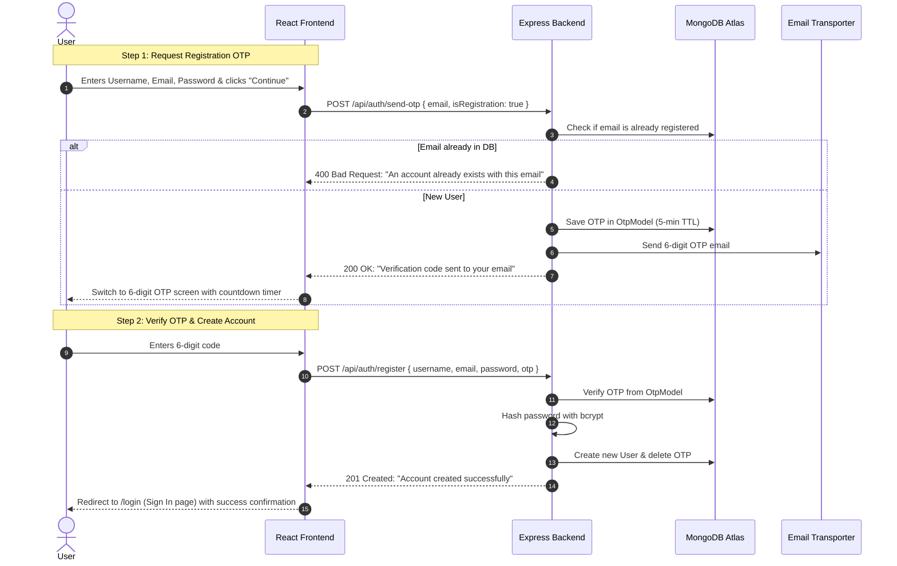

# Reusing Existing OTP Feature for User Registration (Redirect to Sign In)

This guide shows how to **reuse your already implemented OTP system** (`OtpModel`, `sendOtpEmail`, and `/api/auth/send-otp`) to verify email during registration, create the account in the database, and **redirect the user to the Sign In (`/login`) page** upon successful verification.

---

## 1. How the Reused Flow Works



---

## 2. Backend Implementation

In `backend/src/controllers/auth.controller.js`:

### A. Update `sendOtpController` to Support Registration

Allow sending OTP for new registrations when the user doesn't exist yet:

```javascript
/**
 * @name sendOtpController
 * @route POST /api/auth/send-otp
 * @desc Sends 6-digit OTP for both Login and Registration
 */
async function sendOtpController(req, res) {
  try {
    const { email, isRegistration } = req.body;

    if (!email) {
      return res.status(400).json({ message: "Email is required" });
    }

    const normalizedEmail = email.toLowerCase().trim();

    // Check user existence based on flow
    const user = await userModel.findOne({ email: normalizedEmail });

    if (isRegistration) {
      // For Registration: Account must NOT already exist
      if (user) {
        return res
          .status(400)
          .json({
            message: "An account already exists with this email address",
          });
      }
    } else {
      // For Login: Account MUST exist
      if (!user) {
        return res
          .status(404)
          .json({ message: "No account found with this email address" });
      }
    }

    // Generate 6-digit OTP
    const rawOtp = crypto.randomInt(100000, 1000000).toString();

    if (process.env.NODE_ENV !== "production") {
      console.log(
        `[AUTH OTP DEV] Generated OTP for ${normalizedEmail}: ${rawOtp}`,
      );
    }

    // Hash & save to OtpModel (5-min TTL)
    const hashedOtp = await bcrypt.hash(rawOtp, 10);
    await OtpModel.deleteMany({ email: normalizedEmail });
    await OtpModel.create({
      email: normalizedEmail,
      otp: hashedOtp,
      attempts: 0,
    });

    // Send email using existing service
    await sendOtpEmail(normalizedEmail, rawOtp);

    return res.status(200).json({
      message: "Verification code sent to your email",
    });
  } catch (error) {
    console.error("sendOtpController error:", error);
    return res
      .status(500)
      .json({ message: "Failed to send verification code. Please try again." });
  }
}
```

---

### B. Update `registerUserController` to Verify OTP & Create Account

In `backend/src/controllers/auth.controller.js`, update `registerUserController` to verify OTP before creating the user:

```javascript
/**
 * @name registerUserController
 * @route POST /api/auth/register
 * @desc Verifies OTP, creates new user, and prompts login
 * @access Public
 */
async function registerUserController(req, res) {
  try {
    const { username, email, password, otp } = req.body;

    if (!username || !email || !password || !otp) {
      return res
        .status(400)
        .json({
          message: "Username, email, password, and OTP code are required",
        });
    }

    const normalizedEmail = email.toLowerCase().trim();
    const normalizedUsername = username.trim();
    const cleanOtp = String(otp).trim();

    // 1. Check if username or email is already registered
    const isUserAlreadyExists = await userModel.findOne({
      $or: [{ username: normalizedUsername }, { email: normalizedEmail }],
    });

    if (isUserAlreadyExists) {
      return res
        .status(400)
        .json({ message: "User already exists with this username or email" });
    }

    // 2. Verify OTP from OtpModel
    const otpRecord = await OtpModel.findOne({ email: normalizedEmail }).sort({
      createdAt: -1,
    });
    if (!otpRecord) {
      return res
        .status(400)
        .json({
          message:
            "Verification code expired or invalid. Please request a new one.",
        });
    }

    if (otpRecord.attempts >= 5) {
      await OtpModel.deleteMany({ email: normalizedEmail });
      return res
        .status(429)
        .json({
          message: "Too many failed attempts. Please request a new code.",
        });
    }

    const isMatch = await bcrypt.compare(cleanOtp, otpRecord.otp);
    if (!isMatch) {
      otpRecord.attempts += 1;
      await otpRecord.save();
      return res
        .status(400)
        .json({ message: "Incorrect verification code. Please try again." });
    }

    // 3. OTP verified -> delete it from DB
    await OtpModel.deleteMany({ email: normalizedEmail });

    // 4. Hash password & create user in MongoDB
    const hashedPassword = await bcrypt.hash(password, 10);
    const user = await userModel.create({
      username: normalizedUsername,
      email: normalizedEmail,
      password: hashedPassword,
    });

    return res.status(201).json({
      message: "Account created successfully! Please sign in.",
      user: {
        id: user._id,
        username: user.username,
        email: user.email,
      },
    });
  } catch (error) {
    console.error("registerUserController error:", error);
    return res.status(500).json({ message: "Internal server error" });
  }
}
```

---

## 3. Frontend Implementation

### A. Update `register` in `frontend/src/features/auth/services/auth.api.js`

```javascript
export async function register({ username, email, password, otp }) {
  const response = await api.post("/api/auth/register", {
    username,
    email,
    password,
    otp,
  });
  return response.data;
}
```

---

### B. Update `handleRegister` in `frontend/src/features/auth/hooks/useAuth.js`

```javascript
const handleRegister = async ({ username, email, password, otp }) => {
  try {
    setLoading(true);
    const data = await register({ username, email, password, otp });
    return data;
  } catch (error) {
    throw error;
  } finally {
    setLoading(false);
  }
};
```

---

### C. Update `Register.jsx` to 2-Step OTP and Redirect to `/login`

Update `frontend/src/features/auth/pages/Register.jsx`:

```jsx
import React, { useState, useEffect, useRef } from "react";
import { useNavigate, Link } from "react-router";
import { useAuth } from "../hooks/useAuth";
import { sendOtp } from "../services/auth.api";
import "../auth.form.scss";

const Register = () => {
  const { handleRegister } = useAuth();
  const navigate = useNavigate();

  // Steps: 'form' (Step 1) | 'otp' (Step 2)
  const [step, setStep] = useState("form");
  const [username, setUsername] = useState("");
  const [email, setEmail] = useState("");
  const [password, setPassword] = useState("");
  const [otp, setOtp] = useState(["", "", "", "", "", ""]);
  const [loading, setLoading] = useState(false);
  const [error, setError] = useState("");
  const [timer, setTimer] = useState(60);
  const [canResend, setCanResend] = useState(false);

  const inputRefs = useRef([]);
  const isSubmittingRef = useRef(false);

  // ── Resend Countdown Timer ───────────────────────────────────────────
  useEffect(() => {
    let interval = null;
    if (step === "otp" && timer > 0) {
      interval = setInterval(() => setTimer((t) => t - 1), 1000);
    } else if (timer === 0) {
      setCanResend(true);
    }
    return () => clearInterval(interval);
  }, [step, timer]);

  // ── Step 1: Send Registration OTP ────────────────────────────────────
  const handleSendRegisterOtp = async (e) => {
    e?.preventDefault();
    setError("");
    setLoading(true);
    try {
      // Reusing existing sendOtp with isRegistration: true
      await sendOtp({ email, isRegistration: true });
      setStep("otp");
      setTimer(60);
      setCanResend(false);
    } catch (err) {
      setError(
        err.response?.data?.message || "Failed to send verification code.",
      );
    } finally {
      setLoading(false);
    }
  };

  // ── Handle 6-Digit OTP Inputs ────────────────────────────────────────
  const handleOtpChange = (index, value) => {
    setError("");
    const cleaned = value.replace(/\D/g, "");
    if (!cleaned && value !== "") return;

    const newOtp = [...otp];
    newOtp[index] = cleaned ? cleaned.slice(-1) : "";
    setOtp(newOtp);

    // Auto-focus next input
    if (cleaned && index < 5) {
      inputRefs.current[index + 1]?.focus();
    }
  };

  const handleKeyDown = (index, e) => {
    setError("");
    if (e.key === "Backspace" && !otp[index] && index > 0) {
      inputRefs.current[index - 1]?.focus();
    }
  };

  const handlePaste = (e) => {
    setError("");
    e.preventDefault();
    const pasteData = e.clipboardData
      .getData("text")
      .replace(/\D/g, "")
      .slice(0, 6);
    if (pasteData.length > 0) {
      const newOtp = ["", "", "", "", "", ""];
      pasteData.split("").forEach((ch, idx) => {
        if (idx < 6) newOtp[idx] = ch;
      });
      setOtp(newOtp);
      const nextIndex = Math.min(pasteData.length, 5);
      inputRefs.current[nextIndex]?.focus();
    }
  };

  // ── Step 2: Verify OTP, Create Account & Redirect to Sign In ─────────
  const handleVerifyAndRegister = async (e) => {
    e?.preventDefault();
    if (isSubmittingRef.current) return;

    const code = otp.join("");
    if (code.length !== 6) {
      setError("Please enter the complete 6-digit code.");
      return;
    }

    isSubmittingRef.current = true;
    setError("");
    setLoading(true);

    try {
      await handleRegister({
        username,
        email,
        password,
        otp: code,
      });

      // Redirect user to Sign In page with success message
      navigate("/login", {
        state: {
          registeredEmail: email,
          successMessage:
            "Account created successfully! Please sign in with your email.",
        },
      });
    } catch (err) {
      const backendMessage = err.response?.data?.message;
      setError(
        backendMessage ||
          err.message ||
          "Registration failed. Please try again.",
      );
    } finally {
      setLoading(false);
      isSubmittingRef.current = false;
    }
  };

  return (
    <main className="auth-page">
      <div className="auth-card">
        <div className="auth-card__brand">
          <span className="auth-card__brand-dot" />
          SKILLBRIDGE AI
        </div>

        <div className="auth-card__header">
          <h1 className="auth-card__title">
            {step === "form" ? "Create Account" : "Verify Email"}
          </h1>
          <p className="auth-card__subtitle">
            {step === "form"
              ? "Start building your interview strategy"
              : `We sent a verification code to ${email}`}
          </p>
        </div>

        {error && <div className="auth-error">{error}</div>}

        {step === "form" ? (
          <form onSubmit={handleSendRegisterOtp} className="auth-form">
            <div className="auth-field">
              <label className="auth-label">Username</label>
              <input
                type="text"
                className="auth-input"
                placeholder="johndoe"
                value={username}
                onChange={(e) => setUsername(e.target.value)}
                required
                autoFocus
              />
            </div>

            <div className="auth-field">
              <label className="auth-label">Email address</label>
              <input
                type="email"
                className="auth-input"
                placeholder="name@company.com"
                value={email}
                onChange={(e) => setEmail(e.target.value)}
                required
              />
            </div>

            <div className="auth-field">
              <label className="auth-label">Password</label>
              <input
                type="password"
                className="auth-input"
                placeholder="••••••••"
                value={password}
                onChange={(e) => setPassword(e.target.value)}
                required
                minLength={6}
              />
            </div>

            <button type="submit" className="auth-button" disabled={loading}>
              {loading ? "Sending code..." : "Continue"}
            </button>
          </form>
        ) : (
          <form onSubmit={handleVerifyAndRegister} className="auth-form">
            <div
              className="otp-inputs-container"
              style={{
                display: "flex",
                gap: "8px",
                justifyContent: "center",
                margin: "16px 0",
              }}
            >
              {otp.map((digit, idx) => (
                <input
                  key={idx}
                  ref={(el) => (inputRefs.current[idx] = el)}
                  type="text"
                  inputMode="numeric"
                  maxLength={1}
                  value={digit}
                  onChange={(e) => handleOtpChange(idx, e.target.value)}
                  onKeyDown={(e) => handleKeyDown(idx, e)}
                  onPaste={handlePaste}
                  style={{
                    width: "44px",
                    height: "52px",
                    fontSize: "22px",
                    fontWeight: "600",
                    textAlign: "center",
                    background: "#0f172a",
                    border: "1px solid #334155",
                    borderRadius: "8px",
                    color: "#ffffff",
                  }}
                  autoFocus={idx === 0}
                />
              ))}
            </div>

            <button
              type="submit"
              className="auth-button"
              disabled={loading || otp.join("").length !== 6}
            >
              {loading ? "Creating Account..." : "Verify & Create Account"}
            </button>

            <div
              style={{
                marginTop: "16px",
                textAlign: "center",
                fontSize: "14px",
                color: "#94a3b8",
              }}
            >
              {canResend ? (
                <button
                  type="button"
                  onClick={handleSendRegisterOtp}
                  style={{
                    background: "none",
                    border: "none",
                    color: "#38bdf8",
                    cursor: "pointer",
                    fontWeight: "500",
                  }}
                >
                  Resend code
                </button>
              ) : (
                <span>Resend code in {timer}s</span>
              )}
              <span style={{ margin: "0 8px" }}>•</span>
              <button
                type="button"
                onClick={() => {
                  setStep("form");
                  setOtp(["", "", "", "", "", ""]);
                  setError("");
                }}
                style={{
                  background: "none",
                  border: "none",
                  color: "#64748b",
                  cursor: "pointer",
                }}
              >
                Edit details
              </button>
            </div>
          </form>
        )}

        <div className="auth-card__footer">
          <p>
            Already have an account? <Link to="/login">Sign in</Link>
          </p>
        </div>
      </div>
    </main>
  );
};

export default Register;
```

---

### D. Optional: Showing the Success Message on `Login.jsx`

In `frontend/src/features/auth/pages/Login.jsx`, you can read the redirected state to prefill email and show a success banner:

```jsx
import { useLocation } from "react-router";

const Login = () => {
    const location = useLocation();
    const initialEmail = location.state?.registeredEmail || "";
    const successMsg = location.state?.successMessage || "";

    const [email, setEmail] = useState(initialEmail);
    // ...
```

And render `successMsg` if present:

```jsx
{
  successMsg && !error && (
    <div
      style={{
        background: "#064e3b",
        color: "#6ee7b7",
        padding: "10px 14px",
        borderRadius: "6px",
        fontSize: "13px",
        marginBottom: "16px",
      }}
    >
      {successMsg}
    </div>
  );
}
```

---

## 4. Summary of Benefits

- 🎯 **Seamless Redirection**: User confirms their email via OTP, the user is created in MongoDB, and they are immediately brought to `/login` to sign in.
- ⚡ **Zero New Models or Routes**: 100% reuse of `OtpModel`, `sendOtpEmail`, `/api/auth/send-otp`, and `/api/auth/register`.
